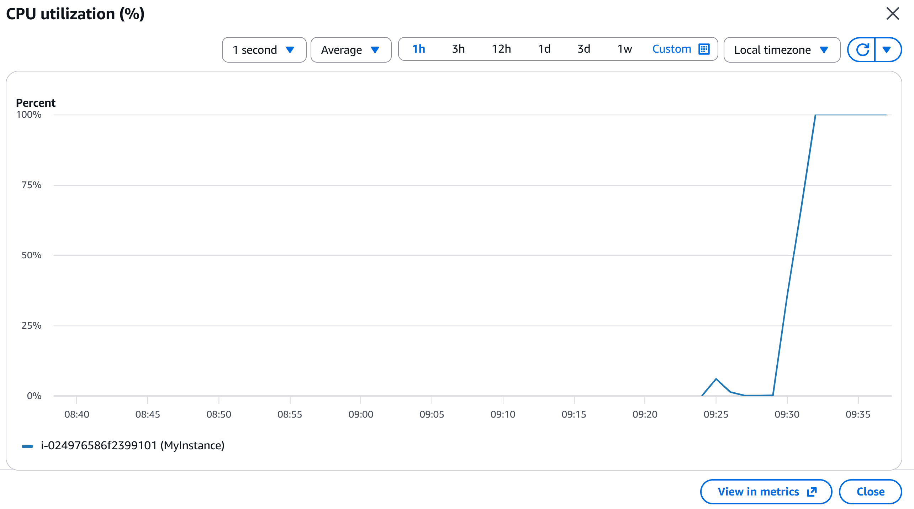
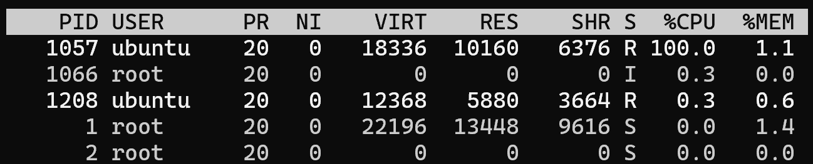
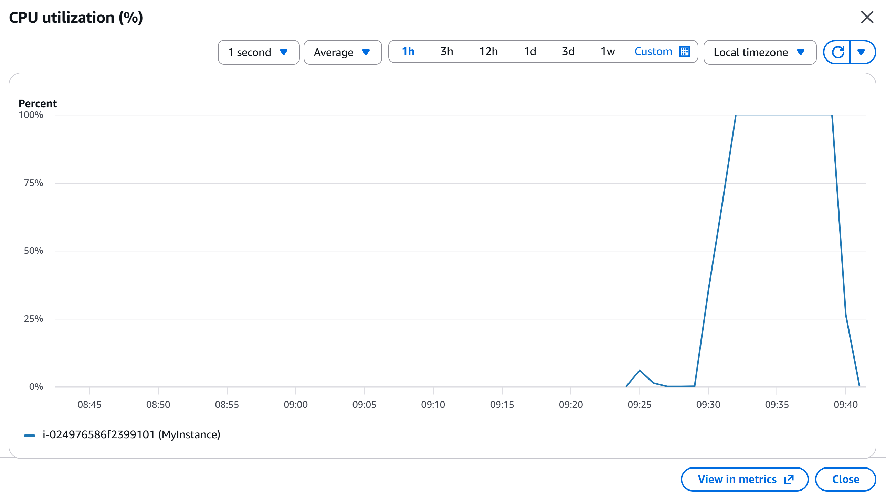

# Incident 01 - EC2 High CPU Utilization

## Overview

This project simulates a real-world production incident where an Amazon EC2 instance experienced abnormally high CPU utilization, causing application performance degradation.

The objective was to identify the root cause, restore the service, and verify that the issue was resolved using standard Linux troubleshooting techniques.

---

## Environment

- Cloud Provider: AWS
- Service: Amazon EC2
- Operating System: Ubuntu 24.04 LTS
- Instance Type: t3.small (2 vCPU) 
- Monitoring: Amazon CloudWatch
- Tools Used:
  - top
  - ps
  - kill
  - SSH

---

## Scenario

Users reported that the website was responding slowly.

CloudWatch showed EC2 CPU Utilization approaching 100%.



---

## Investigation

### 1. Check overall CPU usage

```bash
top
```

Observed that CPU utilization was abnormally high.



---

### 2. Identify CPU-intensive processes

```bash
ps aux --sort=-%cpu
```

Found two `python3 cpu_hog.py` processes consuming the highest CPU resources.


---

### 3. Verify Process 1018

```bash
top -p 1018
```

Confirmed that process 1018 was consuming significant CPU resources.


---

### 4. Verify Process 1205

```bash
top -p 1205
```

Confirmed that process 1205 was consuming significant CPU resources.


---

## Root Cause

Two Python processes entered an infinite CPU-intensive loop.

As both processes continuously executed calculations without stopping, they fully utilized the available vCPUs, resulting in extremely high CPU utilization and degraded application performance.

---

## Resolution

Terminate the abnormal processes.

```bash
kill 1018
kill 1205
```

Both CPU-intensive processes were successfully terminated.


---

## Verification

Run the following command again:

```bash
top
```

CPU utilization returned to normal.

CloudWatch also showed CPU utilization decreasing after the processes were terminated.





---

## Commands Used

```bash
top

ps aux --sort=-%cpu

top -p <PID>

kill <PID>
```

---

## Project Structure

```
incident-01-cpu-100/
├── README.md
├── scripts/
│   └── cpu_hog.py
└── screenshots/
    ├── scenario-cloudwatch-cpu.png
    ├── investigation-top.png
    ├── investigation-ps-aux.png
    ├── investigation-top-p-1018.png
    ├── investigation-top-p-1205.png
    ├── resolution-kill-process.png
    └── verification-top.png
```

---

## Key Skills Demonstrated

- Linux troubleshooting
- Linux process management
- CPU performance analysis
- Amazon EC2 administration
- Amazon CloudWatch monitoring
- Incident investigation
- Root cause analysis
- Incident resolution
- Service verification

---

## Lessons Learned

- High CPU utilization can significantly impact application responsiveness.
- `top` provides a quick overview of system resource usage.
- `ps aux --sort=-%cpu` helps identify CPU-intensive processes.
- `top -p <PID>` can be used to inspect the resource usage of a specific process.
- CloudWatch metrics help correlate system performance with user-reported issues.
- Always verify system recovery after implementing a fix.