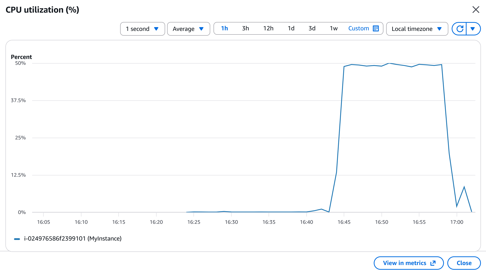

## Investigation

### 1. Check CPU usage

```bash
top
```

CPU utilization was close to 100%.


---

### 2. Identify the process 

```bash
ps aux --sort=-%cpu
```

Found `python3 cpu_hog.py` consuming 99% CPU.


---

### 3. Terminate the process

```bash
kill 1234
```


---

### 4. Verify recovery

```bash
top
```

CPU utilization returned to normal.


